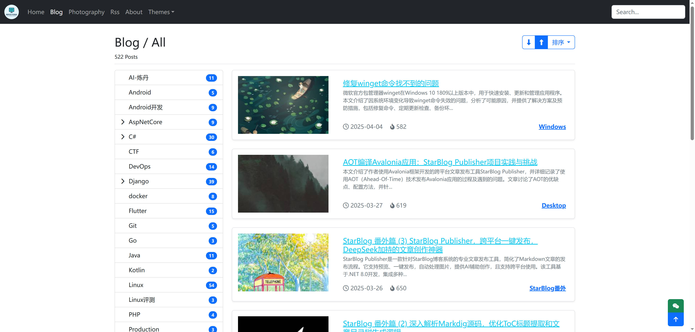

# StarBlog


<p align="center">
  <a href="https://dotnet.microsoft.com/download/dotnet/6.0"></a>
  <a href="https://github.com/Deali-Axy/StarBlog-Admin"></a>
  <a href="https://blog.deali.cn"></a>
  <a href="https://github.com/Deali-Axy/StarBlog-Admin"></a>
</p>

## 📝 简介

StarBlog 是一个基于 .NET 6 和 ASP.NET Core 开发的现代博客系统，支持 Markdown 文章导入，遵循 RESTful 接口规范。前端基于 Vue + ElementUI 开发，可作为 .NET Core 入门学习项目，同时配套了一系列开发笔记，记录了从零开始构建这个博客系统的全过程，可以帮助学习理解 .Net Core 项目的开发流程。

**在线演示**：[https://blog.deali.cn](https://blog.deali.cn)

**管理后台项目**：[https://github.com/Deali-Axy/StarBlog-Admin](https://github.com/Deali-Axy/StarBlog-Admin)

## 📫 项目动机

在线博客平台那么多，**为什么要自己开发博客？**

笔者折腾博客时间不短了，从一开始用WordPress，再到后来用hexo、hugo之类的静态博客生成放github托管，一直在折腾。

折腾是为了更好解决问题，但最终还是打算自己花时间做一个，具体的想法可以查看 [开发笔记](https://www.cnblogs.com/deali/p/16104454.html)

- 找不到一个让我满意的在线博客
- 在线写博客体验不如在本地用typora写
- 写公众号推文的话注意力会分散一部分到如何写得吸引读者而不是文章本身
- 自己的网站才有完整的控制权，不会被垃圾平台添加不良信息污染

## ✨ 特性

- **Markdown 支持**：(**核心功能💡**)本地 Markdown 文章批量导入，支持解析多级分类嵌套和图片自动导入与内容转换
- **文章管理**：支持单篇文章（含图片附件）打包上传和自动导入
- **摄影作品**：支持本地摄影作品批量上传，自动读取 EXIF 信息
- **自定义主页**：可配置的博客主页，支持首页图表/随机图片展示、置顶文章/图片/分类配置
- **主题切换**：博客前台支持多种主题风格切换
- **友情链接**：完整的友情链接管理功能，支持用户自行提交友链申请
- **访问统计**：高性能的访问记录、统计和数据可视化展示
- **随机图片 API**：提供一套随机图片 API，文章封面默认使用随机图片
- **评论系统**：内置用户/游客评论功能，以及评论自动过滤、审核功能
- **RSS 订阅**：支持 RSS 订阅

## 🏗️ 架构

### 技术栈

#### 后端

##### 核心框架与基础设施
- **Web框架**：ASP.NET Core - 跨平台、高性能的 .NET Web 应用框架
- **监控调试**：Rin - ASP.NET Core 应用实时检查工具

##### 数据访问与处理
- **主要ORM**：FreeSql - 高性能、支持多种数据库的 ORM 框架
- **辅助ORM**：Entity Framework Core - 微软官方 ORM 框架
- **对象映射**：AutoMapper - 简化对象-对象映射的工具库

##### API与认证
- **API文档**：Swagger/OpenAPI (Swashbuckle.AspNetCore) - RESTful API 自动文档生成工具
- **认证机制**：JWT (JSON Web Token) - 安全的跨域身份验证解决方案
- **搜索引擎支持**：RobotsTxtCore - 管理搜索引擎爬虫访问策略

##### 内容处理
- **Markdown引擎**：[Markdig](https://github.com/xoofx/markdig) - 高性能 Markdown 处理器
- **图像处理**：ImageSharp - 跨平台图像处理库
- **分页组件**：X.PagedList - 高效的数据分页解决方案
- **RSS支持**：System.ServiceModel.Syndication - RSS 内容聚合工具

##### 通信与工具
- **邮件服务**：MailKit - 跨平台邮件客户端库

#### 前端
- **博客前台**：Bootstrap + Vue + ElementUI + editor.md + bootswatch
- **管理后台**：Vue + Vuex + Vue Router + ElementUI + SCSS

### 项目结构

```
StarBlog/
├── StarBlog.Contrib/       # 通用工具和扩展
├── StarBlog.Data/          # 数据模型和数据访问层
├── StarBlog.Migrate/       # 博客文章导入 CLI 工具
├── StarBlog.Share/         # 共享组件和工具类
└── StarBlog.Web/           # 主 Web 应用项目
```

## 🚀 快速开始

### 环境要求

- .NET 6 SDK
- Node.js 和 npm/yarn（用于前端资源管理）

### 构建步骤

1. **克隆仓库**

```bash
git clone https://github.com/Deali-Axy/StarBlog.git
cd StarBlog
```

2. **前端资源准备**

本项目使用 NPM + Gulp 管理前端静态文件，详情可查看[这篇博客](https://www.cnblogs.com/deali/p/15905760.html)。

```bash
cd StarBlog.Web
npm install  # 或 yarn
npm install --global gulp-cli
gulp move
```

**注意**：本项目依赖 [bootstrap5-treeview](https://www.npmjs.com/package/bootstrap5-treeview) 组件。如果在执行 `npm install` 过程中出错，请先安装 [bower](https://bower.io/)：`npm i -g bower`

3. **运行项目**

使用 Visual Studio 或 Rider 打开解决方案，设置 `StarBlog.Web` 为启动项目并运行。

### 初始化

首次启动项目后，访问 `/Home/Init` 进行管理员账户创建等初始化操作。

**注意**：初始化操作只能执行一次。详情请参考[这篇文章](https://www.cnblogs.com/deali/p/16523157.html)。

## 📚 开发笔记

本项目配套了一系列开发笔记，记录了从零开始构建这个博客系统的全过程，同时可以作为 .NetCore 开发的入门学习教程。


- [基于.NetCore开发博客项目 StarBlog - (1) 为什么需要自己写一个博客？](https://www.cnblogs.com/deali/p/16104454.html)
- [基于.NetCore开发博客项目 StarBlog - (2) 环境准备和创建项目](https://www.cnblogs.com/deali/p/16172342.html)
- [基于.NetCore开发博客项目 StarBlog - (3) 模型设计](https://www.cnblogs.com/deali/p/16180920.html)
- [基于.NetCore开发博客项目 StarBlog - (4) markdown博客批量导入](https://www.cnblogs.com/deali/p/16211720.html)
- [基于.NetCore开发博客项目 StarBlog - (5) 开始搭建Web项目](https://www.cnblogs.com/deali/p/16276448.html)
- [基于.NetCore开发博客项目 StarBlog - (6) 页面开发之博客文章列表](https://www.cnblogs.com/deali/p/16286780.html)
- [基于.NetCore开发博客项目 StarBlog - (7) 页面开发之文章详情页面](https://www.cnblogs.com/deali/p/16293309.html)
- [基于.NetCore开发博客项目 StarBlog - (8) 分类层级结构展示](https://www.cnblogs.com/deali/p/16307604.html)
- [基于.NetCore开发博客项目 StarBlog - (9) 图片批量导入](https://www.cnblogs.com/deali/p/16328825.html)
- [基于.NetCore开发博客项目 StarBlog - (10) 图片瀑布流](https://www.cnblogs.com/deali/p/16335162.html)
- [基于.NetCore开发博客项目 StarBlog - (11) 实现访问统计](https://www.cnblogs.com/deali/p/16349155.html)
- [基于.NetCore开发博客项目 StarBlog - (12) Razor页面动态编译](https://www.cnblogs.com/deali/p/16391656.html)
- [基于.NetCore开发博客项目 StarBlog - (13) 加入友情链接功能](https://www.cnblogs.com/deali/p/16421699.html)
- [基于.NetCore开发博客项目 StarBlog - (14) 实现主题切换功能](https://www.cnblogs.com/deali/p/16441294.html)
- [基于.NetCore开发博客项目 StarBlog - (15) 生成随机尺寸图片](https://www.cnblogs.com/deali/p/16457314.html)
- [基于.NetCore开发博客项目 StarBlog - (16) 一些新功能 (监控/统计/配置/初始化)](https://www.cnblogs.com/deali/p/16523157.html)
- [基于.NetCore开发博客项目 StarBlog - (17) 自动下载文章里的外部图片](https://www.cnblogs.com/deali/p/16586437.html)
- [基于.NetCore开发博客项目 StarBlog - (18) 实现本地Typora文章打包上传](https://www.cnblogs.com/deali/p/16758878.html)
- [基于.NetCore开发博客项目 StarBlog - (19) Markdown渲染方案探索](https://www.cnblogs.com/deali/p/16834452.html)
- [基于.NetCore开发博客项目 StarBlog - (20) 图片显示优化](https://www.cnblogs.com/deali/p/16929677.html)
- [基于.NetCore开发博客项目 StarBlog - (21) 开始开发RESTFul接口](https://www.cnblogs.com/deali/p/16989798.html)
- [基于.NetCore开发博客项目 StarBlog - (22) 开发博客文章相关接口](https://www.cnblogs.com/deali/p/16991279.html)
- [基于.NetCore开发博客项目 StarBlog - (23) 文章列表接口分页、过滤、搜索、排序](https://www.cnblogs.com/deali/p/16992573.html)
- [基于.NetCore开发博客项目 StarBlog - (24) 统一接口数据返回格式](https://www.cnblogs.com/deali/p/16995384.html)
- [基于.NetCore开发博客项目 StarBlog - (25) 图片接口与文件上传](https://www.cnblogs.com/deali/p/16999818.html)
- [基于.NetCore开发博客项目 StarBlog - (26) 集成Swagger接口文档](https://www.cnblogs.com/deali/p/17093390.html)
- [基于.NetCore开发博客项目 StarBlog - (27) 使用JWT保护接口](https://blog.sblt.deali.cn:9000/Blog/Post/541b8beae183d29e)
- [基于.NetCore开发博客项目 StarBlog - (28) 开发友情链接相关接口](https://www.cnblogs.com/deali/p/starblog-28.html)
- [基于.NetCore开发博客项目 StarBlog - (29) 开发RSS订阅功能](https://www.cnblogs.com/deali/p/17501704.html)
- [基于.NetCore开发博客项目 StarBlog - (30) 实现评论系统](https://www.cnblogs.com/deali/p/17910094.html)
- [基于.NetCore开发博客项目 StarBlog - (31) 发布和部署](https://www.cnblogs.com/deali/p/18011965)
- [基于.NetCore开发博客项目 StarBlog - (32) 第一期完结](https://www.cnblogs.com/deali/p/18582026)
- ...

## 📷 截图展示


### 博客主页


### 文章列表



### 摄影页面~~（虽然现在还没把拍的照片放上去就是了）~~


### 管理后台主页


### 后台文章列表


### 文章编辑界面


### 后台图片列表


## 🔗 关注我

公众号 | 公众号二维码 
------- | ------ 
 | 


## 🔄 当前版本的不足之处

从 StarBlog 项目上线至今，我不断学习关于 AspNetCore 的细节知识，相比起刚刚开发这个项目的时候，对框架的熟悉程度提升了一些，自然也发现了之前代码里的局限之处：

- 增删改查的「查」应该使用 patch 方法
- 在 Get 方法接口加上 `[HttpHead]` 来实现对 Head 方法的支持
- 过滤和搜索的接口需要对参数进行 trim
- 不应该将接口的返回值都修改为 `ApiResponse` 类型，应该保留框架的 `ActionResult` 类型，这样功能更多
- 只统一了接口的返回值，没有对异常进行包装，应该使用 `app.UseExceptionHandler` 中间件来实现统一错误处理（也可以使用异常过滤器）
- 对 markdown 的 toc、公式、代码块、表格嵌套图片等还是支持不佳

这些问题将是 v2 版本要解决的。

## 🚀 v2 新版规划

目前规划了一些新的功能和优化，但这肯定不是 v2 版本的全部，各位同学如果有好的建议也可以留言讨论一下~

### 博客前台重构

- 使用 Next.js 重构
- 使用 nodejs 技术栈的 markdown 解析

### 管理后台重构

- 使用基于 react 的技术栈重构

### 新的访问统计功能

- 地理信息可视化
- 搜索引擎收录分析
- 反爬虫功能
- 文章阅读量统计

### 文章编辑功能

- 使用新的 markdown 编辑器（最好像 wagtail 那样所见即所得的）
- 支持在文章中加入更多内容（如视频）

### 文章阅读体验优化

- 使用新的 markdown 渲染工具（目前使用的是我 fork 魔改的 editor.md，用起来还可以，但这个工具很老了，而且也停更了，我希望找一个维护良好更现代的渲染工具来替代）

### 文章加密

- 设置固定密码
- 关注公众号获取动态密码

### 新版搜索功能

- 使用全文检索引擎
- 加入 Embedding

### AI 功能

- 知识库
- 对话功能
- 文章 AI 总结
- 自动评论


## 🙏 致谢

<p align="center">
  
</p>

<p align="center">
  感谢 <a href="https://jb.gg/OpenSourceSupport">JetBrains Open Source Support</a> 提供的免费开发工具 Rider
</p>
