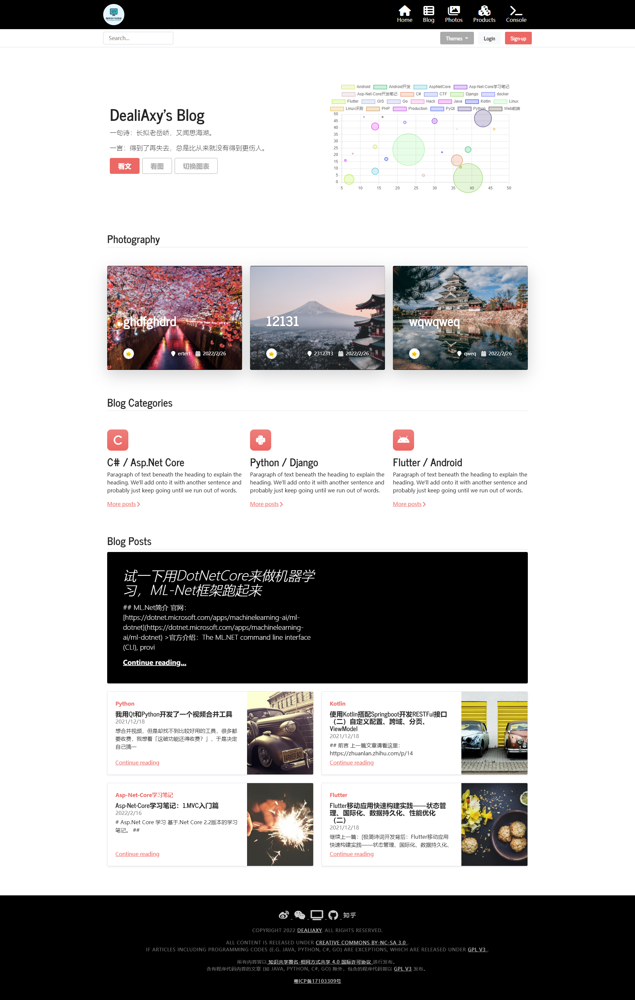
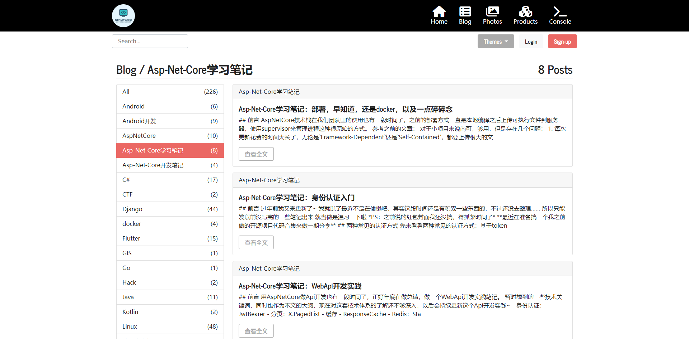
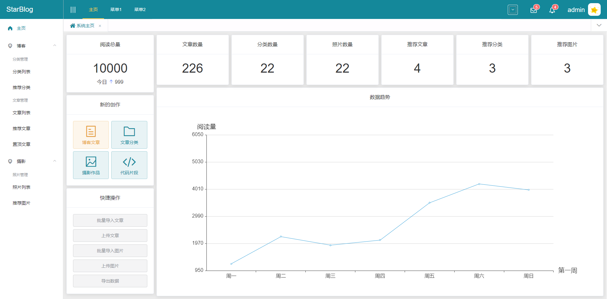
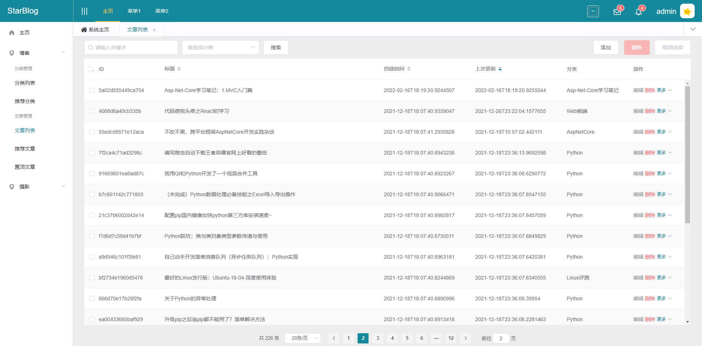
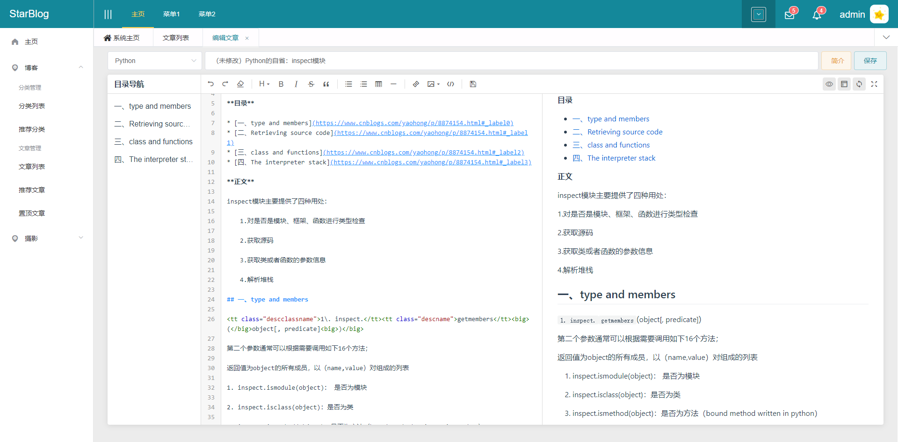
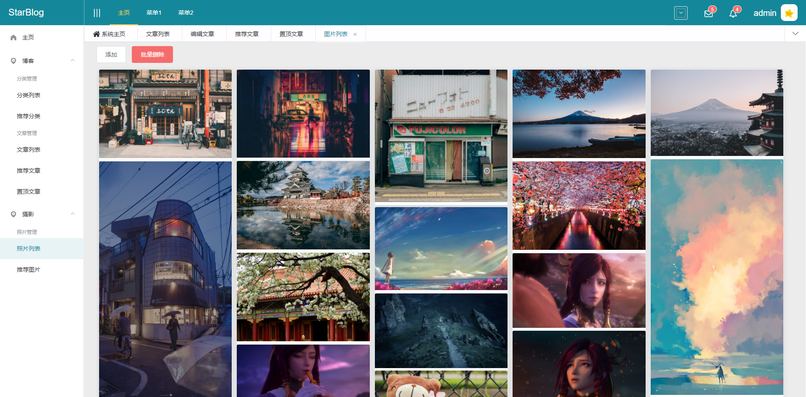

## 博客

支持Markdown导入的博客

后端基于最新的`.Net6`和`Asp.Net Core`框架，遵循RESTFul接口规范，前端基于`Vue`+`ElementUI`开发，可作为 .Net Core 入门项目学习~

博客已经上线，网址：http://blog.deali.cn

配套的管理后台（Vue + ElementUI）前端项目：https://github.com/Deali-Axy/StarBlog-Admin

配套了一系列的开发笔记记录本项目开发过程，欢迎关注

- [基于.NetCore开发博客项目 StarBlog - (1) 为什么需要自己写一个博客？](https://www.cnblogs.com/deali/p/16104454.html)
- [基于.NetCore开发博客项目 StarBlog - (2) 环境准备和创建项目](https://www.cnblogs.com/deali/p/16172342.html)
- [基于.NetCore开发博客项目 StarBlog - (3) 模型设计](https://www.cnblogs.com/deali/p/16180920.html)
- [基于.NetCore开发博客项目 StarBlog - (4) markdown博客批量导入](https://www.cnblogs.com/deali/p/16211720.html)
- [基于.NetCore开发博客项目 StarBlog - (5) 开始搭建Web项目](https://www.cnblogs.com/deali/p/16276448.html)
- [基于.NetCore开发博客项目 StarBlog - (6) 页面开发之博客文章列表](https://www.cnblogs.com/deali/p/16286780.html)
- [基于.NetCore开发博客项目 StarBlog - (7) 页面开发之文章详情页面](https://www.cnblogs.com/deali/p/16293309.html)
- [基于.NetCore开发博客项目 StarBlog - (8) 分类层级结构展示](https://www.cnblogs.com/deali/p/16307604.html)
- [基于.NetCore开发博客项目 StarBlog - (9) 图片批量导入](https://www.cnblogs.com/deali/p/16328825.html)
- [基于.NetCore开发博客项目 StarBlog - (10) 图片瀑布流](https://www.cnblogs.com/deali/p/16335162.html)
- [基于.NetCore开发博客项目 StarBlog - (11) 实现访问统计](https://www.cnblogs.com/deali/p/16349155.html)
- [基于.NetCore开发博客项目 StarBlog - (12) Razor页面动态编译](https://www.cnblogs.com/deali/p/16391656.html)
- [基于.NetCore开发博客项目 StarBlog - (13) 加入友情链接功能](https://www.cnblogs.com/deali/p/16421699.html)
- [基于.NetCore开发博客项目 StarBlog - (14) 实现主题切换功能](https://www.cnblogs.com/deali/p/16441294.html)
- [基于.NetCore开发博客项目 StarBlog - (15) 生成随机尺寸图片](https://www.cnblogs.com/deali/p/16457314.html)
- [基于.NetCore开发博客项目 StarBlog - (16) 一些新功能 (监控/统计/配置/初始化)](https://www.cnblogs.com/deali/p/16523157.html)
- [基于.NetCore开发博客项目 StarBlog - (17) 自动下载文章里的外部图片](https://www.cnblogs.com/deali/p/16586437.html)
- [基于.NetCore开发博客项目 StarBlog - (18) 实现本地Typora文章打包上传](https://www.cnblogs.com/deali/p/16758878.html)
- [基于.NetCore开发博客项目 StarBlog - (19) Markdown渲染方案探索](https://www.cnblogs.com/deali/p/16834452.html)
- [基于.NetCore开发博客项目 StarBlog - (20) 图片显示优化](https://www.cnblogs.com/deali/p/16929677.html)
- [基于.NetCore开发博客项目 StarBlog - (21) 开始开发RESTFul接口](https://www.cnblogs.com/deali/p/16989798.html)
- [基于.NetCore开发博客项目 StarBlog - (22) 开发博客文章相关接口](https://www.cnblogs.com/deali/p/16991279.html)
- [基于.NetCore开发博客项目 StarBlog - (23) 文章列表接口分页、过滤、搜索、排序](https://www.cnblogs.com/deali/p/16992573.html)
- [基于.NetCore开发博客项目 StarBlog - (24) 统一接口数据返回格式](https://www.cnblogs.com/deali/p/16995384.html)
- [基于.NetCore开发博客项目 StarBlog - (25) 图片接口与文件上传](https://www.cnblogs.com/deali/p/16999818.html)
- [基于.NetCore开发博客项目 StarBlog - (26) 集成Swagger接口文档](https://www.cnblogs.com/deali/p/17093390.html)
- [基于.NetCore开发博客项目 StarBlog - (27) 使用JWT保护接口](https://blog.sblt.deali.cn:9000/Blog/Post/541b8beae183d29e)
- ...


公众号 | 公众号 |
------- | ------ | 
 |    |


## 前言

OK，我也来造轮子了

博客系统从一开始用WordPress，再到后来用hexo、hugo之类的静态博客生成放github托管，一直在折腾

折腾是为了更好解决问题，最终还是打算自己花时间搞一个好了

## 为什么要自己开发博客？

- 找不到一个让我满意的在线博客
- 在线写博客体验不如在本地用typora写
- 写公众号推文的话注意力会分散一部分到如何写得吸引读者而不是文章本身
- 自己的网站才有完整的控制权，不会被垃圾平台添加不良信息污染

## 本项目实现的功能

- [x] 本地markdown文章批量上传导入，根据目录结构解析文章分类（支持多级分类嵌套），解析markdown中的图片并导入到网站目录中
- [x] 单篇文章（包括图片附件）打包上传，自动导入功能
- [x] 本地摄影作品批量上传，读取图片EXIF信息并导入
- [x] 可以配置的博客主页（首页图表/随机图片展示；置顶和置顶的文章、图片、分类）
- [ ] 代码片段编辑与分享功能
- [x] 后台需要完整的文章、分类、图片、代码片段编辑功能
- [ ] 博客前台需要有将文章快捷发表到微信公众号、知乎专栏、博客园、掘金等平台的功能
- [x] 博客前台可更换主题风格
- [x] 友情链接
- [x] 访问记录、统计、数据可视化展示
- [ ] 性能更好的访问统计功能
- [x] 一个简单的“关于“页面
- [x] 文章封面支持随机图片 + 一套随机图片API
- [ ] 完善的单元测试
- [ ] 文章快照/编辑历史记录
- [ ] 评论系统
- [ ] RSS订阅

OK，大概就这些了~ 更多功能可能后面想到了就加上~


## 技术

- 后端：C# + AspNetCore
- ORM：FreeSQL
- markdown解析：[Markdig](https://github.com/xoofx/markdig)
- 分页：X.PagedList
- 博客前台：Bootstrap + Vue + editor.md + bootswatch
- 管理端：Vue + Vuex + VueRouter
- 管理端UI：SCSS + ElementUI

## 项目结构

- `StarBlog.Contrib`：一些共享库
- `StarBlog.Data`：数据模型
- `StarBlog.Migrate`：博客文章导入，运行该项目可以将markdown文章批量导入
- `StarBlog.Web`：博客主项目

## Build

本项目基于 .Net6 开发，构建之前请确保已经安装 .Net6 SDK。

### 前端资源

本项目的前端资源使用 `NPM` + `Gulp` 管理，可使用 `NPM` 或 `Yarn` 安装依赖：

详情可以查看这篇博客：[Asp-Net-Core开发笔记：使用NPM和gulp管理前端静态文件](https://www.cnblogs.com/deali/p/15905760.html)

在 `StarBlog.Web` 目录下执行命令

```bash
npm install
// 或者
yarn
```

> PS：因为本项目依赖 [bootstrap5-treeview](https://www.npmjs.com/package/bootstrap5-treeview) 组件
> 
> 如果在执行 `yarn install` 或 `npm install` 过程中出错，请先安装 [bower](https://bower.io/)
> 
> ```bash
> npm i -g bower
> ```

安装 `gulp-cli` 工具

```bash
npm install --global gulp-cli
```

执行gulp任务（同样是在 `StarBlog.Web` 目录下执行命令）

```bash
gulp move
```

然后运行 `StarBlog.Web` 项目即可

### 初始化

项目启动之后，需要进入初始化页面进行管理员创建等操作。

初始化入口：`/Home/Init`

**PS：初始化操作只能进行一次**

详情可以查看这篇文章：[基于.NetCore开发博客项目 StarBlog - (16) 一些新功能 (监控/统计/配置/初始化)](https://www.cnblogs.com/deali/p/16523157.html)


## 博客截图

放几个截图咯

### 博客主页



### 文章列表



### 摄影页面~~（虽然现在还没把拍的照片放上去就是了）~~


### 管理后台主页



### 后台文章列表



### 文章编辑界面



### 后台图片列表



篇幅关系就放这些图片了~

博客马上就部署上线了，到时直接上demo链接！


## 代码高亮：

本来是打算拿`Markdig`的几个第三方插件来试验的，测试后勉强能用就以下两个

- [Markdig.Prism](https://github.com/ilich/Markdig.Prism)：前端渲染，但需要服务端组件配合
- [Markdown.ColorCode](https://github.com/wbaldoumas/markdown-colorcode)：服务端渲染

结果效果都不是很理想，今晚（2022-2-17）看阿星plus的博客，看到`Editor.md`这个组件也可以渲染HTML，立即测试了一下，好用！

所以最终我的markdown渲染HTML以及代码高亮由`Editor.md`承包！

（PS：`Markdig`组件先保留吧）

## Thanks


感谢 [Jetbrains OpenSourceSupport](https://jb.gg/OpenSourceSupport) 提供的免费开发工具Rider，超级好用！


